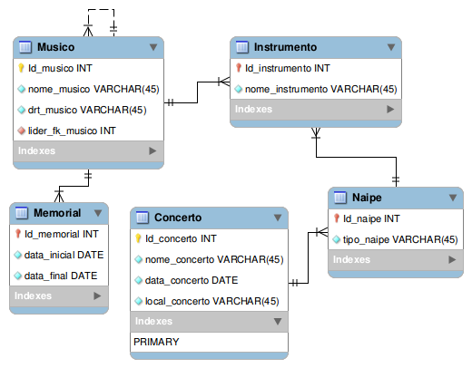

# Caso OSBA

A OSBA tem *músicos* que estão distribuídos em *naipes*, um músico pode ser o chefe de naipe.
A OSBA fará `35` anos em `2017` e quer um *memorial* dos músicos com nome, data de início e a data de saída.
É importante destacar que cada músico toca em um *concerto* por vez.  
Veja o diagrama normalizado: 
